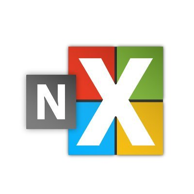
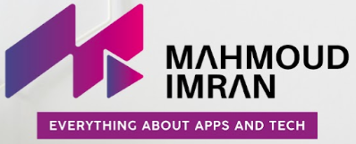
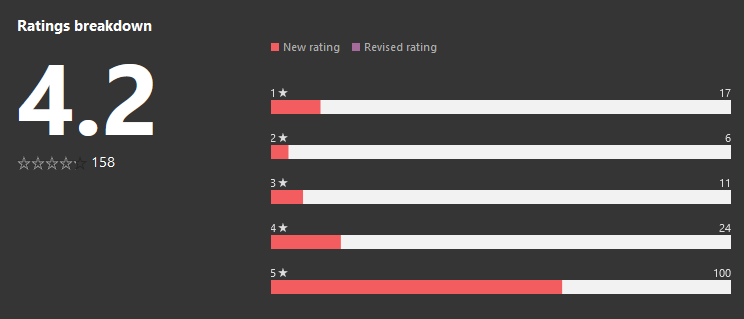

<h2 id="shrestha-files">Shrestha Files</h2>

    
If you are looking for a dual pane file manager with tabs and colorful themes, look no further: Shrestha Files Pro X is here with a modern and minimalist design to supercharge your productivity! <a href="https://www.microsoft.com/store/apps/9npnffsv2hqm?cid=GitHub">Download it from the Microsoft Store Now</a>.

    

        <iframe width="560" height="315" src="https://www.youtube.com/embed/CmNeZp8rDDM" title="Shrestha Files Pro X Introduction" frameborder="0" allow="accelerometer; autoplay; clipboard-write; encrypted-media; gyroscope; picture-in-picture" allowfullscreen></iframe>
    

    <a href="https://youtu.be/fOKNh0Mdl_I">
        <image src="./images/Launch2021/ColorfulShresthaFilesPro.png"/>
    </a>
    <a href="https://youtu.be/fOKNh0Mdl_I">
        <image src="./images/Launch2021/ShresthaFilesProGuideAnimated.gif"/>
    </a>

<h3 id="features">Features</h3>
<ul>
    <li>Fluent design matching the look and feel of Windows 11 and Windows 10
    <ul>
        <li>Standard colorful themes and custom themes by users</li>
    </ul>
    </li>
    <li>Tabbed interface similar to web browsers
    <ul>
        <li>Move tabs from one pane to another</li>
    </ul>
    </li>
    <li>Standard single pane mode for all users or advanced dual pane mode for power users</li>
    <li>Internal viewers for text and image files</li>
    <li>Six different view types
    <ul>
        <li>Simple list, detailed list, small grid, medium grid, large grid, and tiles</li>
    </ul>
    </li>
    <li>Customizable navigation bar with two-level bookmarks</li>
    <li>Built in Zip and Unzip feature</li>
    <li>Drag and drop support
    <ul>
        <li>Drop files and/or folders inside a tab or inside a folder within a tab</li>
    </ul>
    </li>
    <li>Progress indicator for file operations with detailed logs</li>
    <li>Automatically saves and restores open tabs, view types per tab, pane size, etc.</li>
    <li>Search to find items in the current folder and sub-folders</li>
    <li>Quick filter to find items in the current folder</li>
    <li>Properties viewer</li>
    <li>All the standard features of a File Manager
    <ul>
        <li>Copy, Cut, Paste, Rename, Delete, New File, New Folder, etc.</li>
        <li>Sort by item name, type, date, and size</li>
    </ul>
    </li>
</ul>

            
    

<h3 id="speed-test-against-windows-file-explorer">Speed Test Against Windows File Explorer</h3>
<ul>
<li><a href="https://youtu.be/V09G9u-RAR4">Windows File Explorer and Notepad vs Shrestha Files and Internal Text Viewer</a></li>
<li><a href="https://youtu.be/oFsOza1OU0M">Windows File Explorer and Photos vs Shrestha Files and Internal Photo Viewer</a></li>
<li><a href="https://youtu.be/ZVTDLhgIqWg">Windows File Explorer and Movies &amp; TV vs Shrestha Files Pro and Internal Video Viewer</a></li>
<li><a href="https://youtu.be/gTBngQdT3Gw">Windows File Explorer and VLC vs Shrestha Files and Internal Video Viewer</a></li>
</ul>

<h3 id="keyboard-accelerators-shortcuts">Keyboard Accelerators (Shortcuts)</h3>

<h3 id="tips-and-tricks">Tips and Tricks</h3>
<ul>
<li>Users can double click an empty area in a tab to browse the parent directory</li>
<li>Users can right click any navigation bar item to open the path in a new tab or delete the item.</li>
<li>Some settings are currently only accessible from config.json file in app directory.</li>
<li>Users can drag and drop files and folders from inside one tab to inside another tab or inside the folder listed in the tab.</li>
<li>Detailed log are stored in the log.txt in LocalCache directory. If the app crashes, you can email the log and steps to reproduce the crash to the developer so that it can be fixed.</li>
<li>You can launch Shrestha Files from command line or run by typing “file”.</li>
<li>In the Single Click mode, users can click near the border of the item to select the item instead of opening the item.</li>
</ul>

<h3 id="translation">Translation</h3>

If you would like to translate the app in the language of your choice, instructions are provided <a href="https://jptgamesandapps.github.io/ShresthaFiles/translation">here</a>.

    
<h3>Reviews (English)</h3>   

    

        <a href="https://www.softpedia.com/get/File-managers/Shrestha-Files.shtml">
            

                
            

        </a> 

        
        <a href="https://youtu.be/AtSzg57Pceo">
            

                
            

        </a>

        
        <a href="https://alternativeto.net/software/shrestha-files/about/">
            

                
            

        </a>

        
        <a href="https://shrestha-files-pro.en.softonic.com/">
            

                
            

        </a>

        
        <a href="https://betanews.com/2021/02/05/best-windows-10-apps-this-week-203/">
            

                
            

        </a>

        
        <a href="https://www.windowslatestnews.com/shrestha-files-pro-windows-10-file-explorer/">
            

                
            

        </a>

        
        <a href="https://electrodealpro.com/windows-10-file-management-in-2-column-fluent-interface/">
            

                
            

        </a>

        
        <a href="https://nsaneforums.com/topic/415969-microsoft-store-shrestha-files-pro/">
            

                
            

        </a>

    

<h4>Reviews (Non-English)</h4>       

    

        <a href="https://www.chip.de/news/Explorer-Alternative-fuer-Windows-10-Diese-10-Euro-App-gibt-es-aktuell-gratis_183270871.html">
            

                
            

        </a> 

        
        <a href="https://youtu.be/Fk84PkAQ0Eg">
            

                
            

        </a>

        
        <a href="https://www.youtube.com/watch?v=z4RhHVN2FfY">
            

                
            

        </a>

        
        <a href="https://www.deskmodder.de/blog/2021/01/31/shrestha-files-pro-als-windows-10-datei-explorer-app-noch-kurzzeitig-kostenlos/">
            

                
            

        </a>

        
        <a href="https://www.chip.cz/novinky/software/prakticka-alternativa-spravce-souboru-pro-windows-10-je-docasne-k-dispozici-zdarma/">
            

                
            

        </a>

        
        <a href="https://blog.kdata.vn/shrestha-files-pro-dang-mien-phi-cho-nguoi-dung-windows-10-5839/">
            

                
            

        </a>

        
        <a href="https://windowsforum.kr/data/16705506">
            

                
            

        </a>

        
        <a href="https://youtu.be/0h9MDohkjEE">
            

                
            

        </a>

        
        <a href="https://www.descargas.com/app/shrestha-files-pro/windows/">
            

                
            

        </a>

        
        <a href="https://trainghiemso.vn/shrestha-files-free/">
            

                
            

        </a>

        
        <a href="https://freesoft.ru/windows/shrestha-files">
            

                
            

        </a>

        
        <a href="https://techmaniacs.gr/shrestha-files-pro-entelos-dorean-apo-ta-9-eyro-poy-kostizei-gia-windows-10/">
            

                
            

        </a>

        
        <a href="https://shrestha-files-a-modern-dual-panel-file-manager.para-ordenador.com/">
            

                
            

        </a>

        
        <a href="https://www.futurezone.de/digital-life/article231487443/Download-kostenlos-statt-9-Euro-Nur-heute-ist-die-Software-umsonst.html">
            

                
            

        </a>

        
        <a href="https://www.giga.de/news/fuer-windows-10-alternativer-datei-explorer-fuer-kurze-zeit-kostenlos/">
            

                
            

        </a>

        
        <a href="https://bubera.com/pc-software-gadget/about-windows10-shrestha-files-pro/">
            

                
            

        </a>

        <a href="https://www.hcl.hr/vijest/besplatno-se-dijeli-solidna-alternativa-windowsovom-file-exploreru-176332/">
            

                
            

        </a>
        
        <a href="https://www.01net.com/telecharger/windows/Utilitaire/gestion_de_fichier/fiches/157602.html">
            

                
            

        </a>
        
        <a href="https://forum.zyzoom.net/threads/367759/">
            

                
            

        </a>
        
        <a href="http://haohe.fun/2021/09/win10shrestha-files%EF%BC%9A%E9%80%82%E7%94%A8%E4%BA%8E-windows-10-%E5%92%8C-windows-11-%E8%AE%BE%E5%A4%87%E7%9A%84%E7%8E%B0%E4%BB%A3%E5%8F%8C%E7%AA%97%E6%A0%BC%E6%96%87%E4%BB%B6%E7%AE%A1%E7%90%86/">
            

                
            

        </a>
    

<h3 id="note">Note</h3>

This repo does not contain source code for Shrestha Files!

   

 
        
    

