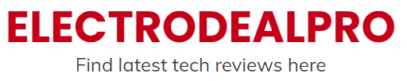

<h2 id="shrestha-files">Shrestha Files</h2>

    
If you are looking for a dual pane file manager with tabs and colorful themes, look no further: Shrestha Files Pro X is here with a modern and minimalist design to supercharge your productivity! <a href="https://www.microsoft.com/store/apps/9npnffsv2hqm?cid=GitHub">Download it from the Microsoft Store Now</a>.

    

        <iframe width="560" height="315" src="https://www.youtube.com/embed/CmNeZp8rDDM" title="Shrestha Files Pro X Introduction" frameborder="0" allow="accelerometer; autoplay; clipboard-write; encrypted-media; gyroscope; picture-in-picture" allowfullscreen></iframe>
    

    

        <h5 class="card-title">Single or Dual Pane</h5>
        <h6 class="card-subtitle mb-2 text-muted">Vertical and Horizontal Dual Panes</h6>
        
Standard single pane mode for all users or more powerful dual pane mode for power users.

    

    

    

        

        <h5 class="card-title">Tabs</h5>
        <h6 class="card-subtitle mb-2 text-muted">Just Like Web Browsers</h6>
        
Enjoy the convenience of having multiple folders open without getting overwhelmed with too many windows open.

        

    

    

        

            <h5 class="card-title">Six Tab View Types</h5>
            <h6 class="card-subtitle mb-2 text-muted">With Customizable Sizes</h6>
            
Choice of simple list, detailed list, tiles, small grid, medium grid, and large grid. Resize the images for any view type from the settings. View types are saved for bookmarks.

        

        

        

            

            <h5 class="card-title">Customizable Icons</h5>
            <h6 class="card-subtitle mb-2 text-muted">For files, folder, libraries, drives, and buttons</h6>
            
Customize the look and feel of the app by creating your own icon pack for various file types, folder, library items, variou types of drives, and buttons such as navigate back and forth. Use simple glyph icons for clean look or colorful icons for fancy look.

            

        

        

            

                <h5 class="card-title">Colorful Themes</h5>
                <h6 class="card-subtitle mb-2 text-muted">To match your personality</h6>
                
It's not just dark and light themes! Choose one of the themes included in the app or create a custom theme based on the sample theme. Some themes are developed to roughly match the colors of super heros (e.g. Batman). (Colors are modified a bit to make them readable.) Set background image and change opacities to fit the themes to your liking. It's like the Google Material You but consider it Shresthat Material You!

            

            

            

                

                <h5 class="card-title">Internal Viewers</h5>
                <h6 class="card-subtitle mb-2 text-muted">Quickly view text and image files</h6>
                
Quickly view text and image files without having to open another app. Text viewer/editor has built in markdown preview feature.

                

            

            

                

                    <h5 class="card-title">Internal Viewers</h5>
                    <h6 class="card-subtitle mb-2 text-muted">Quickly view text and image files</h6>
                    
Quickly view text and image files without having to open another app. Text viewer/editor has built in markdown preview feature.

                

                

                

                    

                    <h5 class="card-title">Bookmarks</h5>
                    <h6 class="card-subtitle mb-2 text-muted">Multi-level bookmark at your convenience</h6>
                    
Ctrl + D to bookmark open folder or drag a folder to the bookmark bar. Organize bookmarks inside bookmark folders.

                    

                

                

                    

                        <h5 class="card-title">Internal Viewers</h5>
                        <h6 class="card-subtitle mb-2 text-muted">Quickly view text and image files</h6>
                        
Quickly view text and image files without having to open another app. Text viewer/editor has built in markdown preview feature.

                    

                    

                    

                    

                        <h5 class="card-title">Built in Zip and Unzip</h5>
                        <h6 class="card-subtitle mb-2 text-muted">File compression at your fingertip</h6>
                        
Compress the files to a zip file or decompress a zip file easily.

                    

                    

                    

                    

                        <h5 class="card-title">Drag and Drop</h5>
                        <h6 class="card-subtitle mb-2 text-muted">Copy or Move Files Easily</h6>
                        
Drag files/folders to a tab page, to a folder, or a tab header. Might need to wiggle a bit to drop.

                    

                    

                    

                    

                        <h5 class="card-title">Progress Indicator</h5>
                        <h6 class="card-subtitle mb-2 text-muted">View File Operation Progress</h6>
                        
Check out the detailed progress of file operations such as copy, move, and delete.

                    

                    

                    

                    

                        <h5 class="card-title">Powerful Search</h5>
                        <h6 class="card-subtitle mb-2 text-muted">Quickly find files/folders you are looking for</h6>
                        
Filter files/folders in the current folder, or find files/folders using simple or advanced search mode. Search by file name, date, and size.

                    

                    

                    

                    

                        <h5 class="card-title">Restore Where You Left</h5>
                        <h6 class="card-subtitle mb-2 text-muted">It Remembers</h6>
                        
Shrestha Files restores the tabs, pane mode, theme, and more from the last session when you reopen the app.

                    

                    

                    

                    

                        <h5 class="card-title">Properties Viewer</h5>
                        <h6 class="card-subtitle mb-2 text-muted">Easily</h6>
                        
View file, folder, and drive properties with Properties Viewer.

                    

                    

                    

                    

                        <h5 class="card-title">Standard File Operations</h5>
                        <h6 class="card-subtitle mb-2 text-muted">All there</h6>
                        
Copy, Cut, Paste, Delete, Share - all right there where you expect.

                    

                    

                    

                    

                        <h5 class="card-title">Sort</h5>
                        <h6 class="card-subtitle mb-2 text-muted">As you wish</h6>
                        
Sort by item name, date, type, or extension.

                    

                    

<h3 id="features">Features</h3>
<ul>
    <li>Fluent design matching the look and feel of Windows 11 and Windows 10
    <ul>
        <li>Standard colorful themes and custom themes by users</li>
    </ul>
    </li>
    <li>Tabbed interface similar to web browsers
    <ul>
        <li>Move tabs from one pane to another</li>
    </ul>
    </li>
    <li>Standard single pane mode for all users or advanced dual pane mode for power users</li>
    <li>Internal viewers for text and image files</li>
    <li>Six different view types
    <ul>
        <li>Simple list, detailed list, small grid, medium grid, large grid, and tiles</li>
    </ul>
    </li>
    <li>Customizable navigation bar with two-level bookmarks</li>
    <li>Built in Zip and Unzip feature</li>
    <li>Drag and drop support
    <ul>
        <li>Drop files and/or folders inside a tab or inside a folder within a tab</li>
    </ul>
    </li>
    <li>Progress indicator for file operations with detailed logs</li>
    <li>Automatically saves and restores open tabs, view types per tab, pane size, etc.</li>
    <li>Search to find items in the current folder and sub-folders</li>
    <li>Quick filter to find items in the current folder</li>
    <li>Properties viewer</li>
    <li>All the standard features of a File Manager
    <ul>
        <li>Copy, Cut, Paste, Rename, Delete, New File, New Folder, etc.</li>
        <li>Sort by item name, type, date, and size</li>
    </ul>
    </li>
</ul>

<h3>Useful Information</h3>
<ul>
    <li><a href="https://jptgamesandapps.github.io/ShresthaFiles/keyboardaccelerators">Keyboard Accelerators</a></li>
    <li><a href="https://jptgamesandapps.github.io/ShresthaFiles/tipsandtricks">Tips and Tricks</a></li>
    <li><a href="https://jptgamesandapps.github.io/ShresthaFiles/translation">Volunteer to Translate</a></li>
    <li><a href="https://jptgamesandapps.github.io/ShresthaFiles/speedtest">Speed Tests</a></li>
</ul>
            

    
<h3>Reviews (English)</h3>   

    

        <a href="https://www.softpedia.com/get/File-managers/Shrestha-Files.shtml">
            

                
            

        </a> 

        
        <a href="https://youtu.be/AtSzg57Pceo">
            

                
            

        </a>

        
        <a href="https://alternativeto.net/software/shrestha-files/about/">
            

                
            

        </a>

        
        <a href="https://shrestha-files-pro.en.softonic.com/">
            

                
            

        </a>

        
        <a href="https://betanews.com/2021/02/05/best-windows-10-apps-this-week-203/">
            

                
            

        </a>

        
        <a href="https://www.windowslatestnews.com/shrestha-files-pro-windows-10-file-explorer/">
            

                
            

        </a>

        
        <a href="https://electrodealpro.com/windows-10-file-management-in-2-column-fluent-interface/">
            

                
            

        </a>

        
        <a href="https://nsaneforums.com/topic/415969-microsoft-store-shrestha-files-pro/">
            

                
            

        </a>

    

<h4>Reviews (Non-English)</h4>       

    

        <a href="https://www.chip.de/news/Explorer-Alternative-fuer-Windows-10-Diese-10-Euro-App-gibt-es-aktuell-gratis_183270871.html">
            

                
            

        </a> 

        
        <a href="https://youtu.be/Fk84PkAQ0Eg">
            

                
            

        </a>

        
        <a href="https://www.youtube.com/watch?v=z4RhHVN2FfY">
            

                
            

        </a>

        
        <a href="https://www.deskmodder.de/blog/2021/01/31/shrestha-files-pro-als-windows-10-datei-explorer-app-noch-kurzzeitig-kostenlos/">
            

                
            

        </a>

        
        <a href="https://www.chip.cz/novinky/software/prakticka-alternativa-spravce-souboru-pro-windows-10-je-docasne-k-dispozici-zdarma/">
            

                
            

        </a>

        
        <a href="https://blog.kdata.vn/shrestha-files-pro-dang-mien-phi-cho-nguoi-dung-windows-10-5839/">
            

                
            

        </a>

        
        <a href="https://windowsforum.kr/data/16705506">
            

                
            

        </a>

        
        <a href="https://youtu.be/0h9MDohkjEE">
            

                
            

        </a>

        
        <a href="https://www.descargas.com/app/shrestha-files-pro/windows/">
            

                
            

        </a>

        
        <a href="https://trainghiemso.vn/shrestha-files-free/">
            

                
            

        </a>

        
        <a href="https://freesoft.ru/windows/shrestha-files">
            

                
            

        </a>

        
        <a href="https://techmaniacs.gr/shrestha-files-pro-entelos-dorean-apo-ta-9-eyro-poy-kostizei-gia-windows-10/">
            

                
            

        </a>

        
        <a href="https://shrestha-files-a-modern-dual-panel-file-manager.para-ordenador.com/">
            

                
            

        </a>

        
        <a href="https://www.futurezone.de/digital-life/article231487443/Download-kostenlos-statt-9-Euro-Nur-heute-ist-die-Software-umsonst.html">
            

                
            

        </a>

        
        <a href="https://www.giga.de/news/fuer-windows-10-alternativer-datei-explorer-fuer-kurze-zeit-kostenlos/">
            

                
            

        </a>

        
        <a href="https://bubera.com/pc-software-gadget/about-windows10-shrestha-files-pro/">
            

                
            

        </a>

        <a href="https://www.hcl.hr/vijest/besplatno-se-dijeli-solidna-alternativa-windowsovom-file-exploreru-176332/">
            

                
            

        </a>
        
        <a href="https://www.01net.com/telecharger/windows/Utilitaire/gestion_de_fichier/fiches/157602.html">
            

                
            

        </a>
        
        <a href="https://forum.zyzoom.net/threads/367759/">
            

                
            

        </a>
        
        <a href="http://haohe.fun/2021/09/win10shrestha-files%EF%BC%9A%E9%80%82%E7%94%A8%E4%BA%8E-windows-10-%E5%92%8C-windows-11-%E8%AE%BE%E5%A4%87%E7%9A%84%E7%8E%B0%E4%BB%A3%E5%8F%8C%E7%AA%97%E6%A0%BC%E6%96%87%E4%BB%B6%E7%AE%A1%E7%90%86/">
            

                
            

        </a>
    

<h3 id="note">Note</h3>

This repo does not contain source code for Shrestha Files!

   

 
        
    

