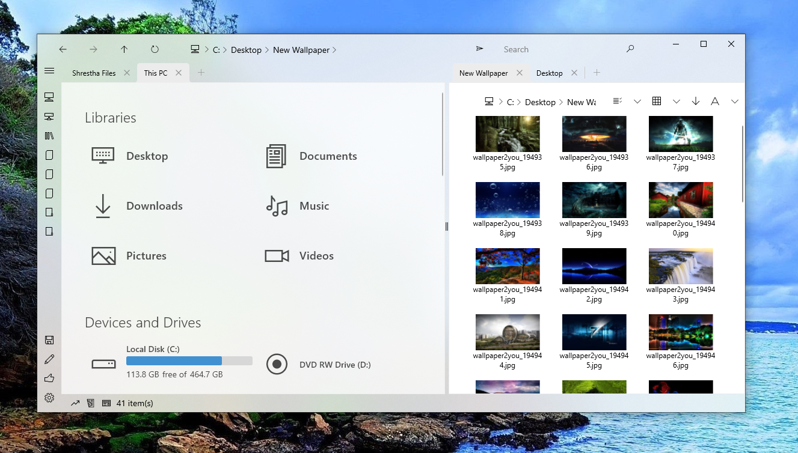

---
title: Home
layout: default
filename: index
--- 

## Shrestha Files

If you like file managers such as Q-dir, Directory Opus, Total Commander, xplorer2, and XYplorer because they offer tabs and multiple panes but do not like the classic Windows 32 style interface or your Windows 10X device does not support them, then Shrestha Files might be what you are looking for. It offers the convenience of tabs and dual pane in a modern and minimalist interface to supercharge your productivity. [Download it from the Microsoft Store Now](https://www.microsoft.com/en-us/p/shrestha-files/9npnffsv2hqm).

### Features
* Modern and fluent design for Windows 10
  * Standard colorful themes and custom themes by users
* Six different view types
  * Simple list, detailed list, small grid, medium grid, large grid, and tiles
* Tabbed interface similar to web browsers
* Standard single pane mode for all users or advanced dual pane mode for power users.
  * Move tabs from one tab to another
* Customizable navigation bar with two-level bookmark
* Built in Zip Archive Creation (Compression) and Extraction (Decompression)
* Drag and drop support
  * Drop files and/or folders inside a tab or inside a folder
* Progress indicator for file operations with detailed logs
* Automatically saves and restores open tabs, view types per tab, pane size, etc.
* Quick filter to find items in the current folder or experiemntal search to find items in current folder and sub-folders
* Properties viewer
* All the standard features of a File Manager
  * Copy, Cut, Paste, Rename, Delete, New File, New Folder, etc.
  * Sort by item name, type, date, and size

### Keyboard Accelerators (Shortcuts)
Note: If keyboard accelerators does not work sometimes, click inside any tab and try again.

### Tips and Tricks
* You can double click on empty area in any tab to navigation to the parent directory (go up a level).
* You can right click any navigation bar item to open the path in a new tab or delete the item.
* Some settings are currently only accessible from config.json file in app directory.
* You can drag and drop files and folders from inside one tab to inside another tab or inside the folder listed in the tab.
* Detailed log are stored in the log.txt in LocalCache directory. If the app crashes, you can email the log and steps to reproduce the crash to the developer so that it can be fixed.
* You can launch Shrestha Files from command line or run by typing "file".
* In the Single Click mode, you can click near the border of the item to select the item instead of opening the item.

### What Others Are Saying About Shrestha Files
#### English
* [Softpedia.com](https://www.softpedia.com/get/File-managers/Shrestha-Files.shtml)
* [NXT Windows](https://youtu.be/AtSzg57Pceo)
* [AlternativeTo.net](https://alternativeto.net/software/shrestha-files/about/)
* [Softonic.com](https://shrestha-files-pro.en.softonic.com/)
* [Betanews.com](https://betanews.com/2021/02/05/best-windows-10-apps-this-week-203/)
* [Windows Latest News](https://www.windowslatestnews.com/shrestha-files-pro-windows-10-file-explorer/)
* [Electrodealpro.com](https://electrodealpro.com/windows-10-file-management-in-2-column-fluent-interface/)

#### Other Languages
* [Deskmodder.de (German)](https://www.deskmodder.de/blog/2021/01/31/shrestha-files-pro-als-windows-10-datei-explorer-app-noch-kurzzeitig-kostenlos/)
* [Chip.de (German)](https://www.chip.de/downloads/Vollversion-Shrestha-Files-Pro_183270094.html)
* [Chip.cz (Czech)](https://www.chip.cz/novinky/software/prakticka-alternativa-spravce-souboru-pro-windows-10-je-docasne-k-dispozici-zdarma/)
* [Descargas (Spanish)](https://www.descargas.com/app/shrestha-files-pro/windows/)
* [Trainghiemso.vn (Vietnamese)](https://trainghiemso.vn/shrestha-files-free/)
* [Techmaniacs.gr (Greek)](https://techmaniacs.gr/shrestha-files-pro-entelos-dorean-apo-ta-9-eyro-poy-kostizei-gia-windows-10/)
* [Para-Ordenador (Spanish)](https://shrestha-files-a-modern-dual-panel-file-manager.para-ordenador.com/)
* [FutureZone.de (German)](https://www.futurezone.de/digital-life/article231487443/Download-kostenlos-statt-9-Euro-Nur-heute-ist-die-Software-umsonst.html)
* [Giga.de (German)](https://www.giga.de/news/fuer-windows-10-alternativer-datei-explorer-fuer-kurze-zeit-kostenlos/)

### Note
This repo does not contain source code for Shrestha Files!

